# Задание 1. B-tree индексы в PostgreSQL

1. Запустите БД через docker compose в ./docker-compose.yml:

2. Выполните запрос для поиска книги с названием 'Oracle Core' и получите план выполнения:
   ```sql
   EXPLAIN ANALYZE
   SELECT * FROM t_books WHERE title = 'Oracle Core';
   ```
   
   *План выполнения:*
    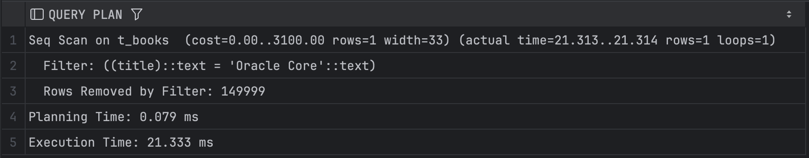
   
   *Объясните результат:*
   Выполнили последовательное сканирование всей таблицы без индексов, поэтому проверялась каждая строка. Всего 150 000 строк, но подходит только одна, поэтому практически все строки были отброшены. Запрос выполнился за $O(n)$.

3. Создайте B-tree индексы:
   ```sql
   CREATE INDEX t_books_title_idx ON t_books(title);
   CREATE INDEX t_books_active_idx ON t_books(is_active);
   ```
   
   *Результат:*
   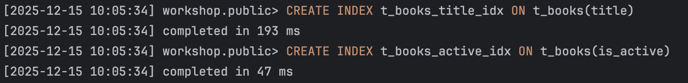

4. Проверьте информацию о созданных индексах:
   ```sql
   SELECT schemaname, tablename, indexname, indexdef
   FROM pg_catalog.pg_indexes
   WHERE tablename = 't_books';
   ```
   
   *Результат:*
   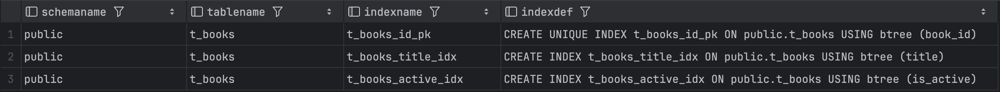
   
   *Объясните результат:*
   Сделали три B-tree индекса:  
   1. По первичному ключу `id`, он также уникальный.
   2. По названию книги `title`, для запроса вида `WHERE title = ...`.
   3. По булевому полю `is_active`.

5. Обновите статистику таблицы:
   ```sql
   ANALYZE t_books;
   ```
   
   *Результат:*
   

6. Выполните запрос для поиска книги 'Oracle Core' и получите план выполнения:
   ```sql
   EXPLAIN ANALYZE
   SELECT * FROM t_books WHERE title = 'Oracle Core';
   ```
   
   *План выполнения:*
   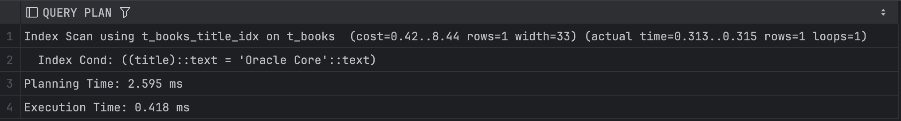
   
   *Объясните результат:*
   Используется Index Scan вместо Seq Scan, потому что запрос совпадает с индексом для названия книги. Скорость заметно увеличилась, потребовалось меньше времени на выполнение запроса – приблизительно $O(logN)$.

7. Выполните запрос для поиска книги по book_id и получите план выполнения:
   ```sql
   EXPLAIN ANALYZE
   SELECT * FROM t_books WHERE book_id = 18;
   ```
   
   *План выполнения:*
   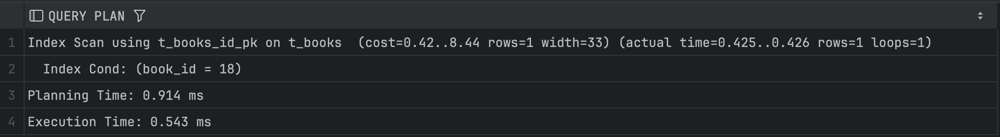
   
   *Объясните результат:*
   Поиск по первичному ключу – следовательно, вернётся только одна строка. Используется поиск по индексу, что также ускорило выполнение.

8. Выполните запрос для поиска активных книг и получите план выполнения:
   ```sql
   EXPLAIN ANALYZE
   SELECT * FROM t_books WHERE is_active = true;
   ```
   
   *План выполнения:*
   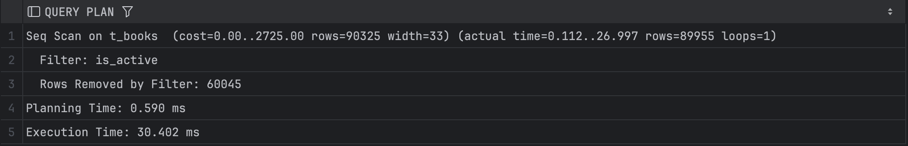
   
   *Объясните результат:*
   В отличие от предыдущих запросов, здесь использовался Seq Scan, а не Index, даже несмотря на то, что у `is_active` есть индексы. Это связано с тем, что выбирается почти половина строк из-за того, что это булево значение, поэтому выгоднее просто просканировать все строки.

9. Посчитайте количество строк и уникальных значений:
   ```sql
   SELECT 
       COUNT(*) as total_rows,
       COUNT(DISTINCT title) as unique_titles,
       COUNT(DISTINCT category) as unique_categories,
       COUNT(DISTINCT author) as unique_authors
   FROM t_books;
   ```
   
   *Результат:*
   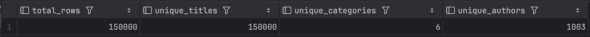

10. Удалите созданные индексы:
    ```sql
    DROP INDEX t_books_title_idx;
    DROP INDEX t_books_active_idx;
    ```
    
    *Результат:*
    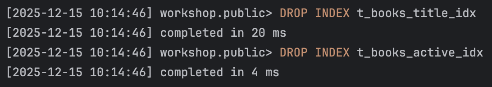

11. Основываясь на предыдущих результатах, создайте индексы для оптимизации следующих запросов:  
    a. `WHERE title = $1 AND category = $2`  
    b. `WHERE title = $1`  
    c. `WHERE category = $1 AND author = $2`  
    d. `WHERE author = $1 AND book_id = $2`
    
    *Созданные индексы:*
    ```sql
    CREATE INDEX t_books_title_category_idx ON t_books(title, category);
    CREATE INDEX t_books_title_idx ON t_books(title);
    CREATE INDEX t_books_category_author_idx ON t_books(category, author);
    CREATE INDEX t_books_author_book_id_idx ON t_books(author, book_id);
    ```
    
    *Объясните ваше решение:*
    Сделали 4 новых индекса:  
    1. Поиск по названию и категории – названия все уникальные, что хорошо, также вторым условием идёт категория.
    2. Поиск только по названию – из предыдущего запроса видно, что у всех книг уникальные названия, поэтому уместно создать индекс.
    3. Поиск по катогории и автору – категорий сильно меньше, чем значений в других колонках, что уменьшает выборку.
    4. Поиск по автору и id книги - поиск по автору и дополнительно по id книги, всегда будет возвращаться не более одной строки.

12. Протестируйте созданные индексы.
    
    *Результаты тестов:*
    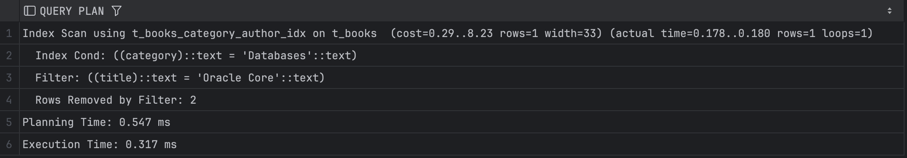
    
    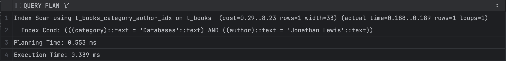
    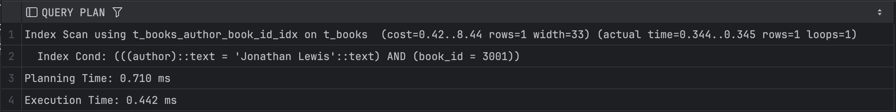
    
    *Объясните результаты:*  
    1. Сначала были выбраны строки по категории, а после этого по названию книги. Использовались сделанные нами индексы.
    2. Используется индекс по названию книги – как и в предыдущих заданиях. Выполняется дольше, чем прошлый запрос. 
    3. Полностью используется индекс, быстрый запрос.
    4. Также используется индекс, запрос ещё быстрее выполняется, так как есть id.

13. Выполните регистронезависимый поиск по началу названия:
    ```sql
    EXPLAIN ANALYZE
    SELECT * FROM t_books WHERE title ILIKE 'Relational%';
    ```
    
    *План выполнения:*
    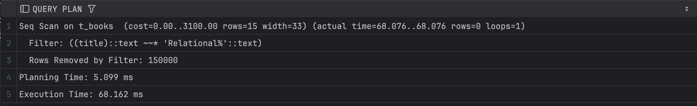
    
    *Объясните результат:*
    Индекс не используется, вместо этого Seq Scan. B-tree зависит от регистра, поэтому сравненить с индексом невозможно. Запрос долгий.

14. Создайте функциональный индекс:
    ```sql
    CREATE INDEX t_books_up_title_idx ON t_books(UPPER(title));
    ```
    
    *Результат:*
    

15. Выполните запрос из шага 13 с использованием UPPER:
    ```sql
    EXPLAIN ANALYZE
    SELECT * FROM t_books WHERE UPPER(title) LIKE 'RELATIONAL%';
    ```
    
    *План выполнения:*
    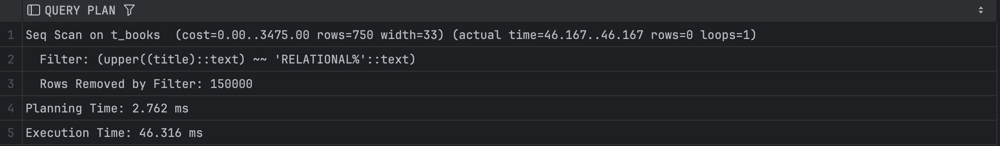
    
    *Объясните результат:*
    Индекс для работы с регистром создан, но всё равно не применён – используется Seq Scan. Скорее всего, потому что строк слишком много и запрос неоптимизирован.

16. Выполните поиск подстроки:
    ```sql
    EXPLAIN ANALYZE
    SELECT * FROM t_books WHERE title ILIKE '%Core%';
    ```
    
    *План выполнения:*
    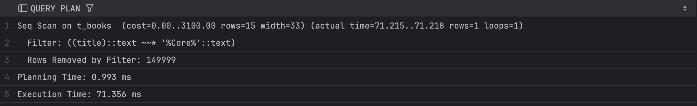
    
    *Объясните результат:*
    Снова используется Seq Scan, потому что B-tree индексы не работают с `%`, так как нет фиксированного начала строки и нельзя использовать упорядоченные деревья. Приходится сканировать всю таблицу.

17. Попробуйте удалить все индексы:
    ```sql
    DO $$ 
    DECLARE
        r RECORD;
    BEGIN
        FOR r IN (SELECT indexname FROM pg_indexes 
                  WHERE tablename = 't_books' 
                  AND indexname != 'books_pkey')
        LOOP
            EXECUTE 'DROP INDEX ' || r.indexname;
        END LOOP;
    END $$;
    ```
    
    *Результат:*
    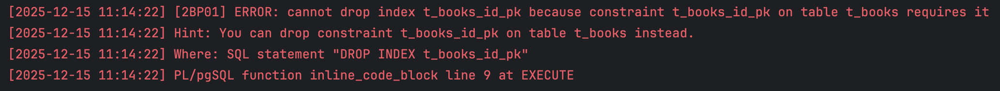
    
    *Объясните результат:*
    Индекс `t_books_id_pk` связан с PRIMARY KEY, поэтмоу не может быть удалён напрямую через `DROP INDEX`. Следовательно, возникает ошибка.

18. Создайте индекс для оптимизации суффиксного поиска:
    ```sql
    -- Вариант 1: с reverse()
    CREATE INDEX t_books_rev_title_idx ON t_books(reverse(title));
    
    -- Вариант 2: с триграммами
    CREATE EXTENSION IF NOT EXISTS pg_trgm;
    CREATE INDEX t_books_trgm_idx ON t_books USING gin (title gin_trgm_ops);
    ```
    
    *Результаты тестов:*
    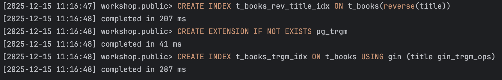
    
    *Объясните результаты:*  
    1. Первый вариант ускоряет запросы вида `WHERE reverse(title) LIKE reverse('%Core')`, он подходит только для суффиксного поиска и не универсален.
    2. Этот индекс поддерживает операции типа `LIKE`, `ILIKE`, `%`, работает для префиксов, суффиксов и подстрок. Хорошо подходит для текстового поиска. При этом создавался сильно дольше, чем первый вариант.

19. Выполните поиск по точному совпадению:
    ```sql
    EXPLAIN ANALYZE
    SELECT * FROM t_books WHERE title = 'Oracle Core';
    ```
    
    *План выполнения:*
    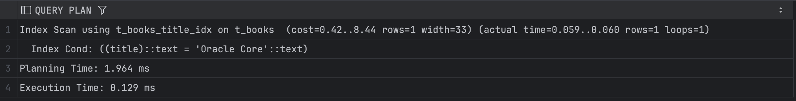
    
    *Объясните результат:*
    При поиске точного совпадения использовался индекс по названию книги – самый дешёвый индекс по сравнению с только что созданными. GIN и reverse-индексы здесь не нужны.

20. Выполните поиск по началу названия:
    ```sql
    EXPLAIN ANALYZE
    SELECT * FROM t_books WHERE title ILIKE 'Relational%';
    ```
    
    *План выполнения:*
    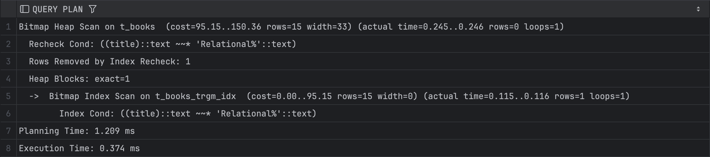
    
    *Объясните результат:*
    Используется GIN и trigrams, потому что `ILIKE 'Relational%'` хорошо раскладывается на триграммы. Эффективно читаются только нужные блоки, скорость заметно быстрее.

21. Создайте свой пример индекса с обратной сортировкой:
    ```sql
    CREATE INDEX t_books_desc_idx ON t_books(title DESC);
    ```
    
    *Тестовый запрос:*
    ```sql
    EXPLAIN ANALYZE
    SELECT * FROM t_books
    ORDER BY title DESC
    LIMIT 10;
    ```

    *План выполнения:*
    
    
    *Объясните результат:*
    Результат оказался хорошим, быстрым. Индексы с сортировкой полезны для ORDER BY. 