# Задание 2: Специальные случаи использования индексов

# Партиционирование и специальные случаи использования индексов

1. Удалите прошлый инстанс PostgreSQL - `docker-compose down` и запустите новый: `docker-compose up -d`.

2. Создайте партиционированную таблицу и заполните её данными:

    ```sql
    -- Создание партиционированной таблицы
    CREATE TABLE t_books_part (
        book_id     INTEGER      NOT NULL,
        title       VARCHAR(100) NOT NULL,
        category    VARCHAR(30),
        author      VARCHAR(100) NOT NULL,
        is_active   BOOLEAN      NOT NULL
    ) PARTITION BY RANGE (book_id);

    -- Создание партиций
    CREATE TABLE t_books_part_1 PARTITION OF t_books_part
        FOR VALUES FROM (MINVALUE) TO (50000);

    CREATE TABLE t_books_part_2 PARTITION OF t_books_part
        FOR VALUES FROM (50000) TO (100000);

    CREATE TABLE t_books_part_3 PARTITION OF t_books_part
        FOR VALUES FROM (100000) TO (MAXVALUE);

    -- Копирование данных из t_books
    INSERT INTO t_books_part 
    SELECT * FROM t_books;
    ```

3. Обновите статистику таблиц:
   ```sql
   ANALYZE t_books;
   ANALYZE t_books_part;
   ```
   
   *Результат:*
   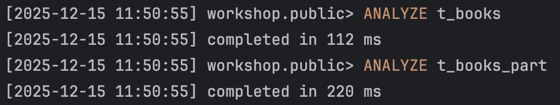

4. Выполните запрос для поиска книги с id = 18:
   ```sql
   EXPLAIN ANALYZE
   SELECT * FROM t_books_part WHERE book_id = 18;
   ```
   
   *План выполнения:*
   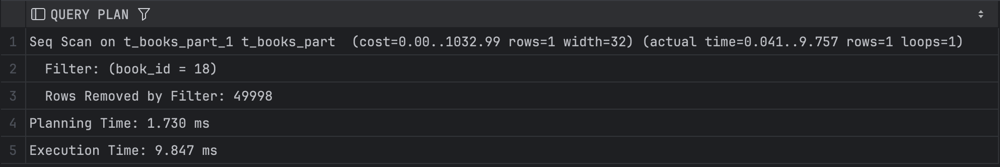
   
   *Объясните результат:*
   Выполнено partition pruning, из всех партиций была выбрана только t_books_part_1, так как значение book_id = 18 попадает в диапазон (1, 50000). Внутри выбранной партиции был выполнен Seq Scan, потому что индекс по book_id отсутствует, а партиционирование не заменяет индексы. Партиционирование сократило объём данных в 3 раза, но без индекса поиск всё равно линейный по времени.

5. Выполните поиск по названию книги:
   ```sql
   EXPLAIN ANALYZE
   SELECT * FROM t_books_part 
   WHERE title = 'Expert PostgreSQL Architecture';
   ```
   
   *План выполнения:*
   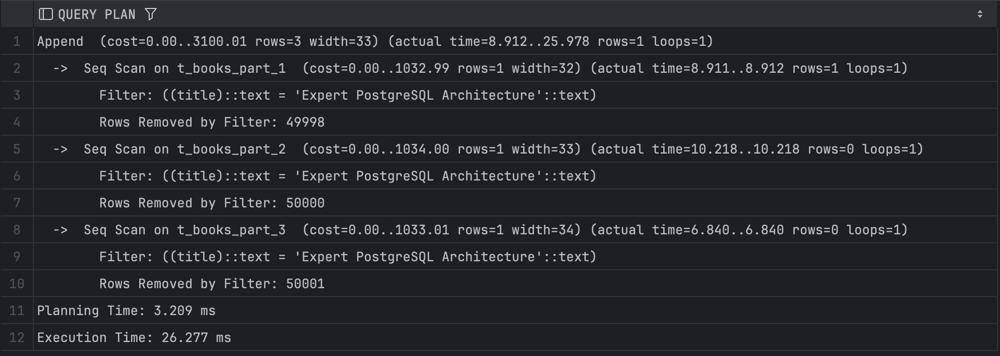
   
   *Объясните результат:*
   Условие `title = ...` не связано с ключом партиционирования, поэтому партиции не отбрасываются, каждая партиция сканируется полностью через Seq Scan. Партиционирование не помогает, если фильтр не по ключу партиции.

6. Создайте партиционированный индекс:
   ```sql
   CREATE INDEX ON t_books_part(title);
   ```
   
   *Результат:*
   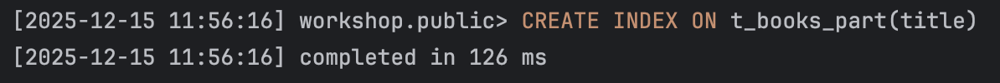

7. Повторите запрос из шага 5:
   ```sql
   EXPLAIN ANALYZE
   SELECT * FROM t_books_part 
   WHERE title = 'Expert PostgreSQL Architecture';
   ```
   
   *План выполнения:*
   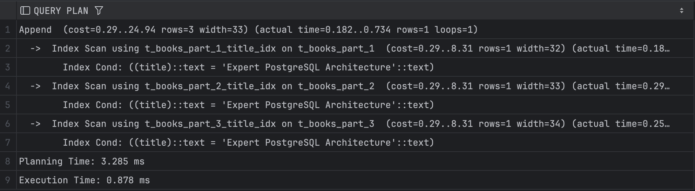
   
   *Объясните результат:*
   Теперь каждая партиция использует Index Scan, чтение ограничено логарифмической сложностью по времени. В итоге время запроса сократилось.

8. Удалите созданный индекс:
   ```sql
   DROP INDEX t_books_part_title_idx;
   ```
   
   *Результат:*
   

9. Создайте индекс для каждой партиции:
   ```sql
   CREATE INDEX ON t_books_part_1(title);
   CREATE INDEX ON t_books_part_2(title);
   CREATE INDEX ON t_books_part_3(title);
   ```
   
   *Результат:*
   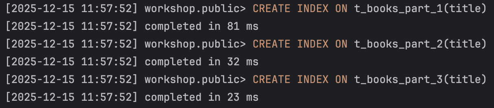

10. Повторите запрос из шага 5:
    ```sql
    EXPLAIN ANALYZE
    SELECT * FROM t_books_part 
    WHERE title = 'Expert PostgreSQL Architecture';
    ```
    
    *План выполнения:*
    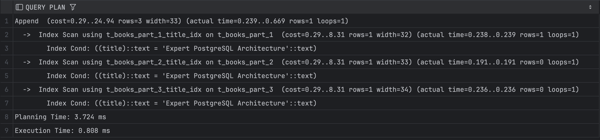
    
    *Объясните результат:*
    Результат практически совпадает с пунктом 7, потому что партиционированный индекс логически схож с набором индексов на партициях. То есть партиционированный индекс – это управляемая абстракция над локальными индексами.

11. Удалите созданные индексы:
    ```sql
    DROP INDEX t_books_part_1_title_idx;
    DROP INDEX t_books_part_2_title_idx;
    DROP INDEX t_books_part_3_title_idx;
    ```
    
    *Результат:*
    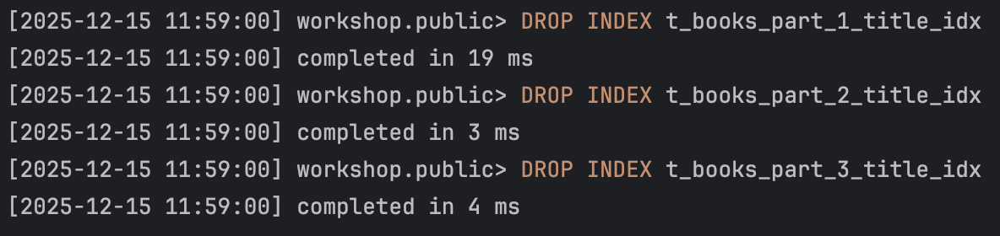

12. Создайте обычный индекс по book_id:
    ```sql
    CREATE INDEX t_books_part_idx ON t_books_part(book_id);
    ```
    
    *Результат:*
    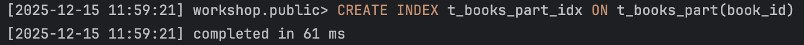

13. Выполните поиск по book_id:
    ```sql
    EXPLAIN ANALYZE
    SELECT * FROM t_books_part WHERE book_id = 11011;
    ```
    
    *План выполнения:*
    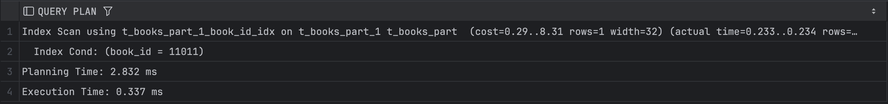
    
    *Объясните результат:*
    Создали локальные индексы по book_id, после чего применился partition pruning и Index Scan. В итоге определяется нужную партиция и используется B-tree индекс внутри неё.

14. Создайте индекс по полю is_active:
    ```sql
    CREATE INDEX t_books_active_idx ON t_books(is_active);
    ```
    
    *Результат:*
    

15. Выполните поиск активных книг с отключенным последовательным сканированием:
    ```sql
    SET enable_seqscan = off;
    EXPLAIN ANALYZE
    SELECT * FROM t_books WHERE is_active = true;
    SET enable_seqscan = on;
    ```
    
    *План выполнения:*
    
    
    *Объясните результат:*
    При отключённом последовательном сканировании PostgreSQL вынужден использовать индекс, даже если это невыгодно. Но условие `is_active = true` выбирает большую часть таблицы и индекс не даёт выигрыша. Индекс может быть использован принудительно, но это не делает запрос быстрее.

16. Создайте составной индекс:
    ```sql
    CREATE INDEX t_books_author_title_index ON t_books(author, title);
    ```
    
    *Результат:*
    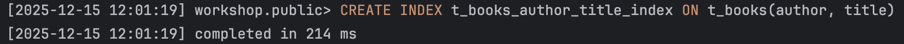

17. Найдите максимальное название для каждого автора:
    ```sql
    EXPLAIN ANALYZE
    SELECT author, MAX(title) 
    FROM t_books 
    GROUP BY author;
    ```
    
    *План выполнения:*
    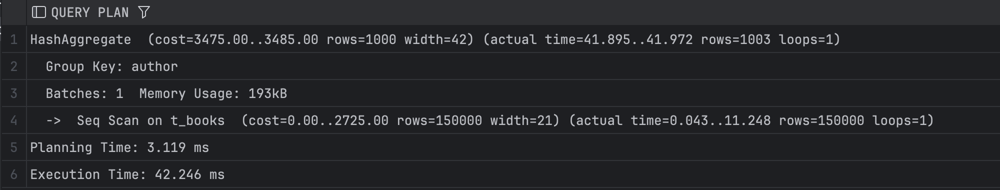
    
    *Объясните результат:*
    Несмотря на наличие индекса по автору и названию, был выбран Seq Scan и HashAggregate, потому что агрегат MAX(title) не может эффективно использовать индекс без ORDER BY, а также последовательное чтение и хеш-агрегация дешевле. Индекс не помогает для всех агрегатных запросов.

18. Выберите первых 10 авторов:
    ```sql
    EXPLAIN ANALYZE
    SELECT DISTINCT author 
    FROM t_books 
    ORDER BY author 
    LIMIT 10;
    ```
    
    *План выполнения:*
    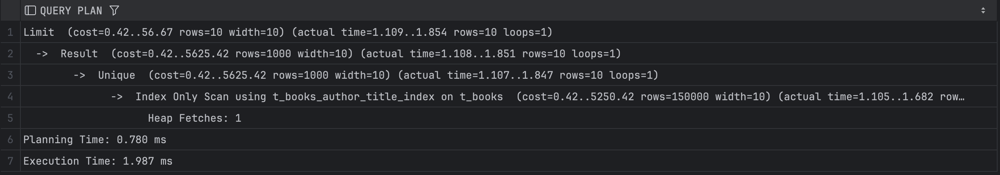
    
    *Объясните результат:*
    Индекс отсортирован по author, данные читаются без обращения к таблице, Heap Fetches: 1 – почти идеальный для сканирования. Здесь правильно подобран индекс.

19. Выполните поиск и сортировку:
    ```sql
    EXPLAIN ANALYZE
    SELECT author, title 
    FROM t_books 
    WHERE author LIKE 'T%'
    ORDER BY author, title;
    ```
    
    *План выполнения:*
    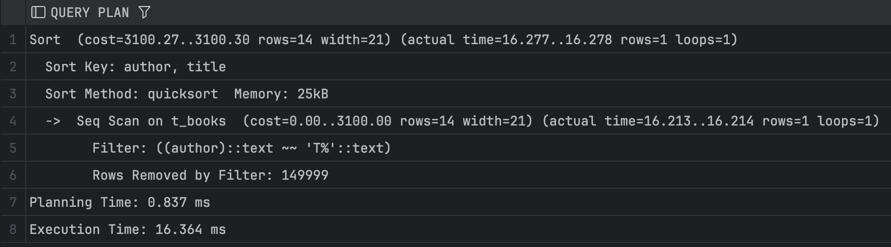
    
    *Объясните результат:*
    Индекс `(author, title)` не используется, потому что `LIKE 'T%'` без text_pattern_ops не гарантирует использование B-tree, селективность очень низкая, так как выбрана 1 строка. Используется Seq Scan и Sort.

20. Добавьте новую книгу:
    ```sql
    INSERT INTO t_books (book_id, title, author, category, is_active)
    VALUES (150001, 'Cookbook', 'Mr. Hide', NULL, true);
    COMMIT;
    ```
    
    *Результат:*
    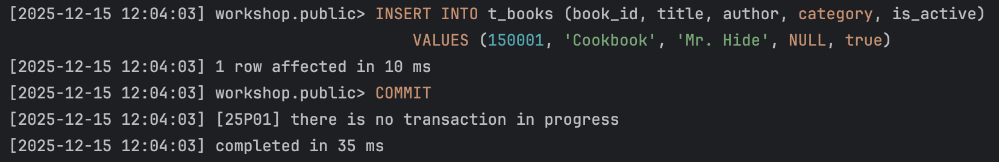

21. Создайте индекс по категории:
    ```sql
    CREATE INDEX t_books_cat_idx ON t_books(category);
    ```
    
    *Результат:*
    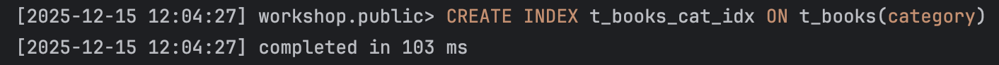

22. Найдите книги без категории:
    ```sql
    EXPLAIN ANALYZE
    SELECT author, title 
    FROM t_books 
    WHERE category IS NULL;
    ```
    
    *План выполнения:*
    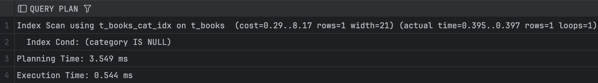
    
    *Объясните результат:*
    B-tree индекс по category содержит NULL-значения, поэтому может использоваться для IS NULL. PostgreSQL выполнил Index Scan, быстро найдя строку без категории.

23. Создайте частичные индексы:
    ```sql
    DROP INDEX t_books_cat_idx;
    CREATE INDEX t_books_cat_null_idx ON t_books(category) WHERE category IS NULL;
    ```
    
    *Результат:*
    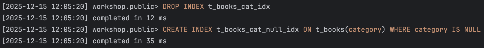

24. Повторите запрос из шага 22:
    ```sql
    EXPLAIN ANALYZE
    SELECT author, title 
    FROM t_books 
    WHERE category IS NULL;
    ```
    
    *План выполнения:*
    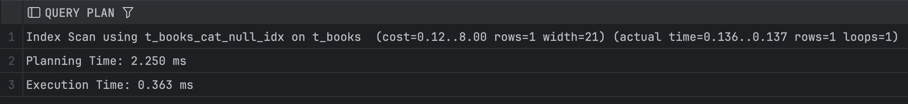
    
    *Объясните результат:*
    Частичный индекс содержит только релевантные строки, поэтому индекс меньше, чтений меньше, план дешевле.Частичные индексы оптимальны для редких, специфических условий.

25. Создайте частичный уникальный индекс:
    ```sql
    CREATE UNIQUE INDEX t_books_selective_unique_idx 
    ON t_books(title) 
    WHERE category = 'Science';
    
    -- Протестируйте его
    INSERT INTO t_books (book_id, title, author, category, is_active)
    VALUES (150002, 'Unique Science Book', 'Author 1', 'Science', true);
    
    -- Попробуйте вставить дубликат
    INSERT INTO t_books (book_id, title, author, category, is_active)
    VALUES (150003, 'Unique Science Book', 'Author 2', 'Science', true);
    
    -- Но можно вставить такое же название для другой категории
    INSERT INTO t_books (book_id, title, author, category, is_active)
    VALUES (150004, 'Unique Science Book', 'Author 3', 'History', true);
    ```
    
    *Результат:*
    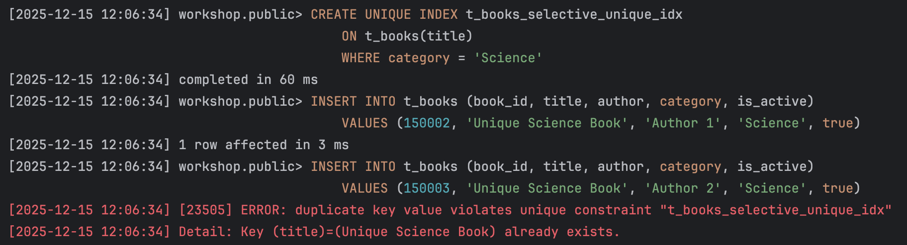
    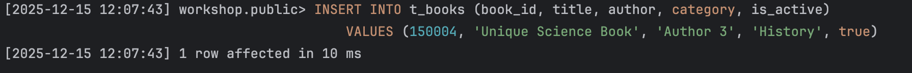
    
    *Объясните результат:*
    Индекс обеспечивает уникальность только внутри категории Science и отсутствие ограничений для других категорий. В результате дубликат в Science приводит к ошибке, а такое же название в History допустимо.