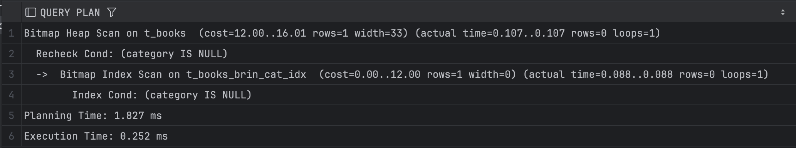
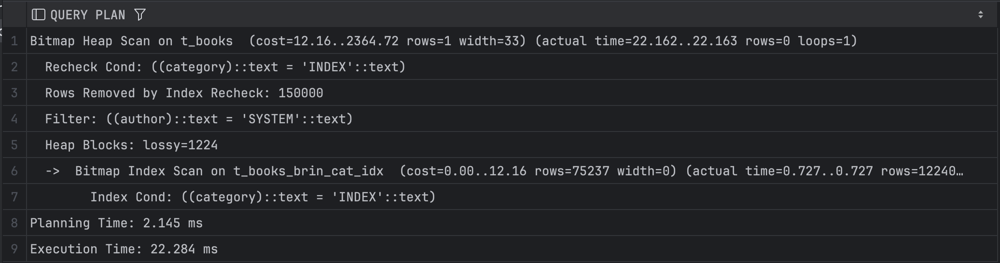
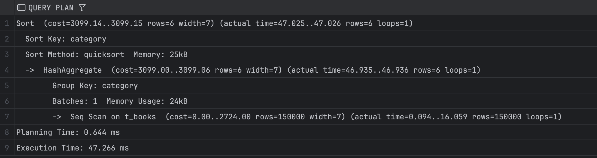
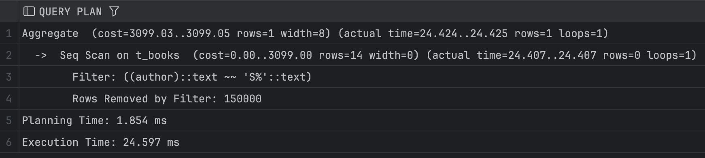
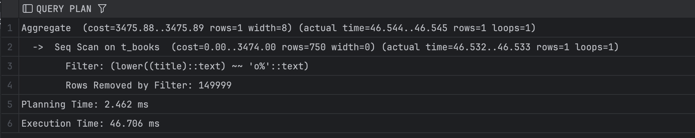
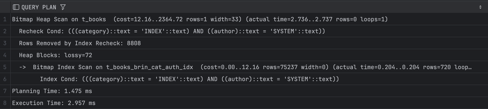

# Задание 1: BRIN индексы и bitmap-сканирование

1. Удалите старую базу данных, если есть:
   ```shell
   docker compose down
   ```

2. Поднимите базу данных из src/docker-compose.yml:
   ```shell
   docker compose down && docker compose up -d
   ```

3. Обновите статистику:
   ```sql
   ANALYZE t_books;
   ```

4. Создайте BRIN индекс по колонке category:
   ```sql
   CREATE INDEX t_books_brin_cat_idx ON t_books USING brin(category);
   ```

5. Найдите книги с NULL значением category:
   ```sql
   EXPLAIN ANALYZE
   SELECT * FROM t_books WHERE category IS NULL;
   ```
   
   *План выполнения:*
   
   
   *Объясните результат:*  
   PostgreSQL использует BRIN индекс, который хранит только минимальные и максимальные значения колонок на блок страницы. Для поиска NULL индекс определяет страницы, которые могут содержать такие строки, создаёт bitmap этих страниц и проверяет каждую строку на условие category IS NULL.

   Строк с NULL нет, поэтому скан завершился быстро.

6. Создайте BRIN индекс по автору:
   ```sql
   CREATE INDEX t_books_brin_author_idx ON t_books USING brin(author);
   ```

7. Выполните поиск по категории и автору:
   ```sql
   EXPLAIN ANALYZE
   SELECT * FROM t_books 
   WHERE category = 'INDEX' AND author = 'SYSTEM';
   ```
   
   *План выполнения:*
   
   
   *Объясните результат (обратите внимание на bitmap scan):*  
   Сначала Postgres использует BRIN индекс по категории для быстрого нахождения страниц, где может быть category='INDEX'. Bitmap строится на уровне страниц, потом выполняется проверка каждой строки и фильтрация по атвору. `Rows Removed by Index Recheck: 150000` показывает, что индекс указывает на страницы, где строки не соответствуют полностью условию, поэтому Postgres проверяет их вручную. Большое время выполнения объясняется большим количеством проверяемых страниц.

8. Получите список уникальных категорий:
   ```sql
   EXPLAIN ANALYZE
   SELECT DISTINCT category 
   FROM t_books 
   ORDER BY category;
   ```
   
   *План выполнения:*
   
   
   *Объясните результат:*
   Postgres делает полный последовательный скан таблицы, потому что BRIN индекс эффективен только для диапазонных фильтров, а не для агрегирования уникальных значений. Все 150000 строк просканированы, поэтому время 47 ms.

9. Подсчитайте книги, где автор начинается на 'S':
   ```sql
   EXPLAIN ANALYZE
   SELECT COUNT(*) 
   FROM t_books 
   WHERE author LIKE 'S%';
   ```
   
   *План выполнения:*
   
   
   *Объясните результат:*
   Для поиска по условию с LIKE 'S%' без индекса надо полное последовательное сканирование, потому что B-tree или BRIN индекс по автору не использовался.

10. Создайте индекс для регистронезависимого поиска:
    ```sql
    CREATE INDEX t_books_lower_title_idx ON t_books(LOWER(title));
    ```

11. Подсчитайте книги, начинающиеся на 'O':
    ```sql
    EXPLAIN ANALYZE
    SELECT COUNT(*) 
    FROM t_books 
    WHERE LOWER(title) LIKE 'o%';
    ```
   
   *План выполнения:*
   
   
   *Объясните результат:*
   Используется Seq Scan, потому что фильтр применяет lower(title). Индекс создаётся отдельно для lower(title), после его создания поиск будет выполняться через индекс и станет быстрее.

12. Удалите созданные индексы:
    ```sql
    DROP INDEX t_books_brin_cat_idx;
    DROP INDEX t_books_brin_author_idx;
    DROP INDEX t_books_lower_title_idx;
    ```

13. Создайте составной BRIN индекс:
    ```sql
    CREATE INDEX t_books_brin_cat_auth_idx ON t_books 
    USING brin(category, author);
    ```

14. Повторите запрос из шага 7:
    ```sql
    EXPLAIN ANALYZE
    SELECT * FROM t_books 
    WHERE category = 'INDEX' AND author = 'SYSTEM';
    ```
   
   *План выполнения:*
   
   
   *Объясните результат:*
   Создан составной BRIN индекс по (category, author), который позволяет Postgres сразу искать строки с нужной комбинацией значений. Bitmap строится быстрее, потому что индекс более точный, поэтому меньше страниц нужно для проверки. `Rows Removed by Index Recheck: 8808` – Postgres проверяет строки на точное соответствие, но их меньше, чем при отдельном индексе. Время запроса сильно уменьшилось.
