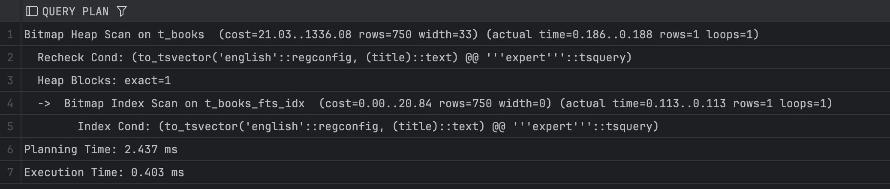
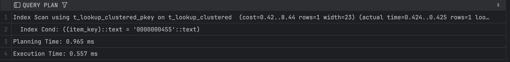
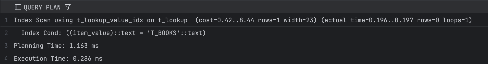

## Задание 2

1. Удалите старую базу данных, если есть:
    ```shell
    docker compose down
    ```

2. Поднимите базу данных из src/docker-compose.yml:
    ```shell
    docker compose down && docker compose up -d
    ```

3. Обновите статистику:
    ```sql
    ANALYZE t_books;
    ```

4. Создайте полнотекстовый индекс:
    ```sql
    CREATE INDEX t_books_fts_idx ON t_books 
    USING GIN (to_tsvector('english', title));
    ```

5. Найдите книги, содержащие слово 'expert':
    ```sql
    EXPLAIN ANALYZE
    SELECT * FROM t_books 
    WHERE to_tsvector('english', title) @@ to_tsquery('english', 'expert');
    ```
    
    *План выполнения:*
    
    
    *Объясните результат:*
    Создан GIN индекс по to_tsvector(title), который поддерживает полнотекстовый поиск. Postgres строит bitmap страниц, содержащих строки с expert в title, потом проверяет их на точное соответствие. Время выполнения очень маленькое, потому что используется фильтрация через индекс.

6. Удалите индекс:
    ```sql
    DROP INDEX t_books_fts_idx;
    ```

7. Создайте таблицу lookup:
    ```sql
    CREATE TABLE t_lookup (
         item_key VARCHAR(10) NOT NULL,
         item_value VARCHAR(100)
    );
    ```

8. Добавьте первичный ключ:
    ```sql
    ALTER TABLE t_lookup 
    ADD CONSTRAINT t_lookup_pk PRIMARY KEY (item_key);
    ```

9. Заполните данными:
    ```sql
    INSERT INTO t_lookup 
    SELECT 
         LPAD(CAST(generate_series(1, 150000) AS TEXT), 10, '0'),
         'Value_' || generate_series(1, 150000);
    ```

10. Создайте кластеризованную таблицу:
     ```sql
     CREATE TABLE t_lookup_clustered (
          item_key VARCHAR(10) PRIMARY KEY,
          item_value VARCHAR(100)
     );
     ```

11. Заполните её теми же данными:
     ```sql
     INSERT INTO t_lookup_clustered 
     SELECT * FROM t_lookup;
     
     CLUSTER t_lookup_clustered USING t_lookup_clustered_pkey;
     ```

12. Обновите статистику:
     ```sql
     ANALYZE t_lookup;
     ANALYZE t_lookup_clustered;
     ```

13. Выполните поиск по ключу в обычной таблице:
     ```sql
     EXPLAIN ANALYZE
     SELECT * FROM t_lookup WHERE item_key = '0000000455';
     ```
     
     *План выполнения:*
     
     
     *Объясните результат:*
     Первичный ключ – B-tree индекс, поэтому поиск происходит через индексное сканирование. Все строки с нужным ключом находятся напрямую, без полного сканирования.

14. Выполните поиск по ключу в кластеризованной таблице:
     ```sql
     EXPLAIN ANALYZE
     SELECT * FROM t_lookup_clustered WHERE item_key = '0000000455';
     ```
     
     *План выполнения:*
     
     
     *Объясните результат:*
     Кластеризация физически упорядочила строки по первичному ключу. Index Scan использует B-tree, но данные читаются локально. Время уменьшилось.

15. Создайте индекс по значению для обычной таблицы:
     ```sql
     CREATE INDEX t_lookup_value_idx ON t_lookup(item_value);
     ```

16. Создайте индекс по значению для кластеризованной таблицы:
     ```sql
     CREATE INDEX t_lookup_clustered_value_idx 
     ON t_lookup_clustered(item_value);
     ```

17. Выполните поиск по значению в обычной таблице:
     ```sql
     EXPLAIN ANALYZE
     SELECT * FROM t_lookup WHERE item_value = 'T_BOOKS';
     ```
     
     *План выполнения:*
     
     
     *Объясните результат:*
     Создан B-tree индекс по колонке item_value. Postgres ищет строки с item_value='T_BOOKS' напрямую через индекс. Ничего не найдено.

18. Выполните поиск по значению в кластеризованной таблице:
     ```sql
     EXPLAIN ANALYZE
     SELECT * FROM t_lookup_clustered WHERE item_value = 'T_BOOKS';
     ```
     
     *План выполнения:*
     
     
     *Объясните результат:*
     Индекс по item_value на кластеризованной таблице. Хотя строк с T_BOOKS нет, чтение более локальное из-за кластеризации, поэтому чуть дольше планирование, но физическое чтение может быть быстрее.

19. Сравните производительность поиска по значению в обычной и кластеризованной таблицах:
     
     *Сравнение:*
     По первичному ключу оба варианта очень быстрые, но кластеризация чуть ускоряет чтение из-за локальности.  
     По значению item_value кластеризация почти не даёт прироста для одиночного поиска, но при массовых выборках или диапазонных запросах преимущество будет заметнее.
     В итоге кластеризация полезна для ускорения последовательного чтения или диапазонных запросов, а точечные запросы по индексу выигрывают мало, но всё равно чуть быстрее на кластеризованной таблице.
