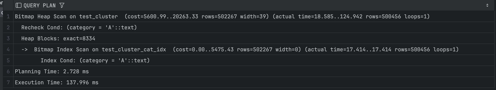
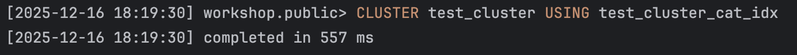
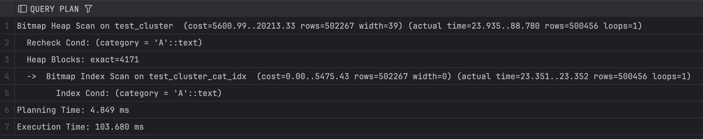

## Задание 3

1. Создайте таблицу с большим количеством данных:
    ```sql
    CREATE TABLE test_cluster AS 
    SELECT 
        generate_series(1,1000000) as id,
        CASE WHEN random() < 0.5 THEN 'A' ELSE 'B' END as category,
        md5(random()::text) as data;
    ```

2. Создайте индекс:
    ```sql
    CREATE INDEX test_cluster_cat_idx ON test_cluster(category);
    ```

3. Измерьте производительность до кластеризации:
    ```sql
    EXPLAIN ANALYZE
    SELECT * FROM test_cluster WHERE category = 'A';
    ```
    
    *План выполнения:*
    
    
    *Объясните результат:*
    Создан B-tree индекс по category. Bitmap Index Scan определяет страницы, содержащие строки с category='A', а потом Bitmap Heap Scan считывает их. До кластеризации строки с 'A' распределены случайно по всему табличному файлу, поэтому было чтение многих несмежных блоков.

4. Выполните кластеризацию:
    ```sql
    CLUSTER test_cluster USING test_cluster_cat_idx;
    ```
    
    *Результат:*
    

5. Измерьте производительность после кластеризации:
    ```sql
    EXPLAIN ANALYZE
    SELECT * FROM test_cluster WHERE category = 'A';
    ```
    
    *План выполнения:*
    
    
    *Объясните результат:*
    После CLUSTER по индексу category строки с одинаковой категорией физически расположились подряд. Postgres считывает меньшее количество блоков. Следовательно, время выполнения упало.

6. Сравните производительность до и после кластеризации:
    
    *Сравнение:*
    До кластеризации строки распределены случайно, поэтому читается больше блоков, из-за этого дольше работает всё.  
    После кластеризации: строки с одной категорией сгруппированы, поэтому меньше случайных чтений, что ускоряет запросы.  
    Как итог, кластеризация особенно полезна для диапазонных запросов и выборки по часто фильтруемым колонкам, улучшая производительность за счёт физической локальности данных.
