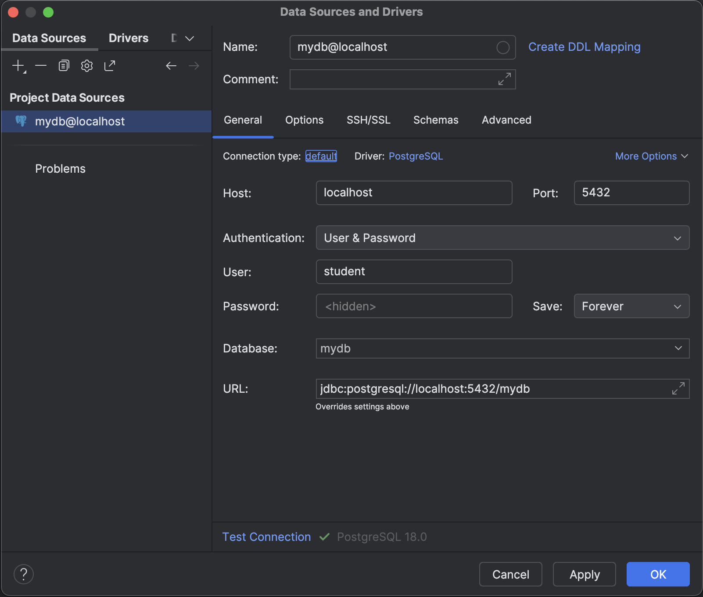
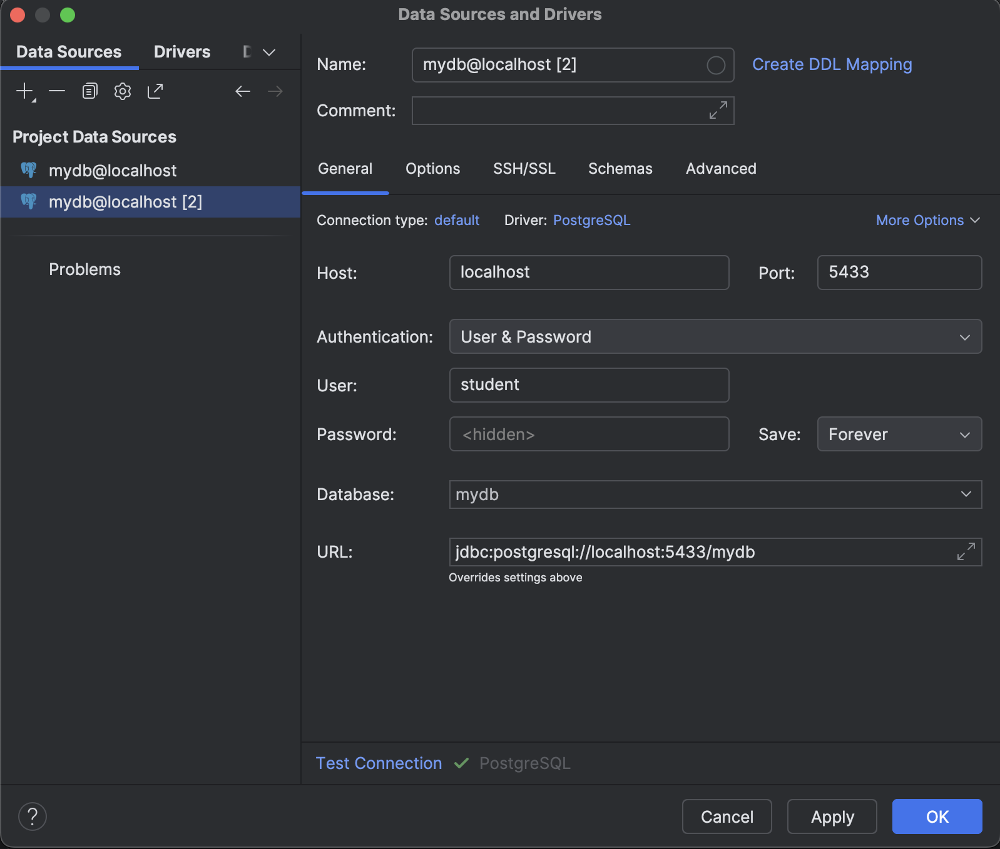
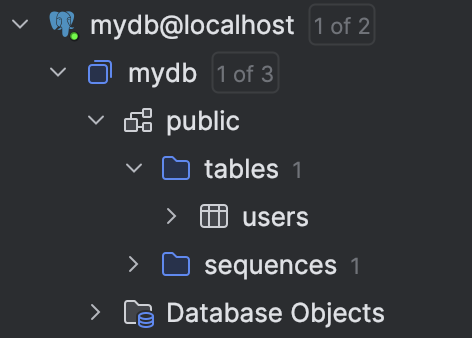
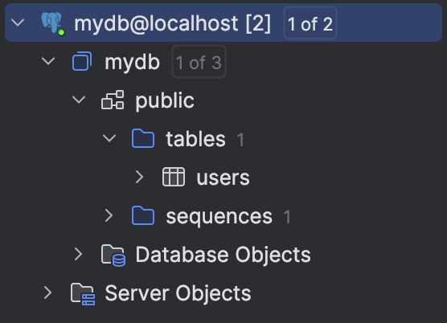
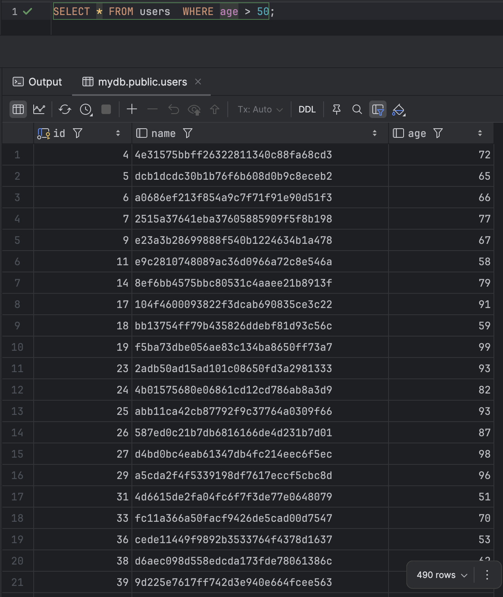
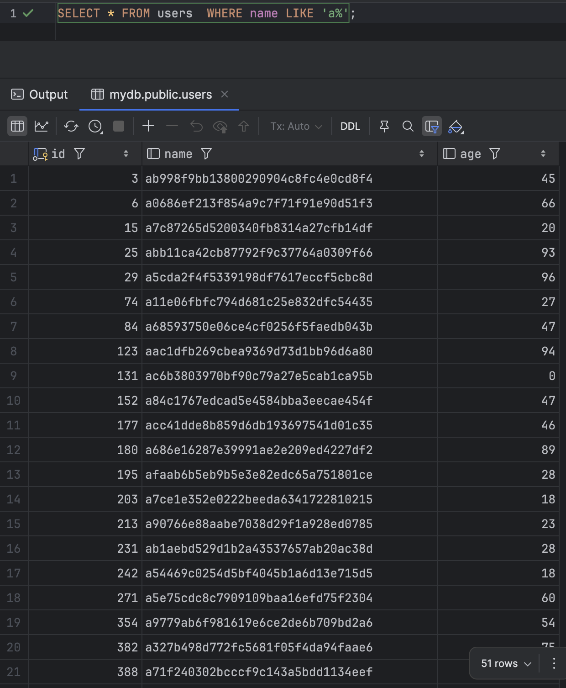
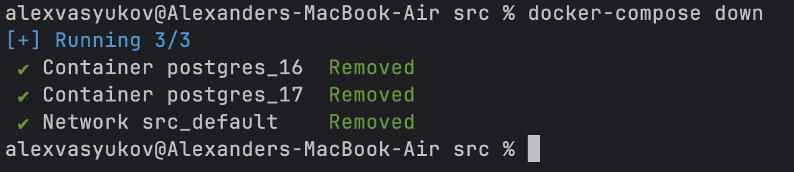
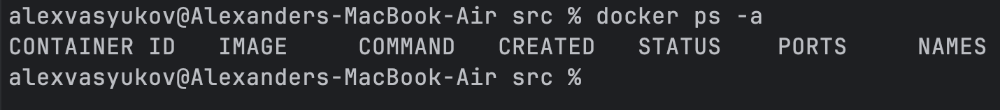
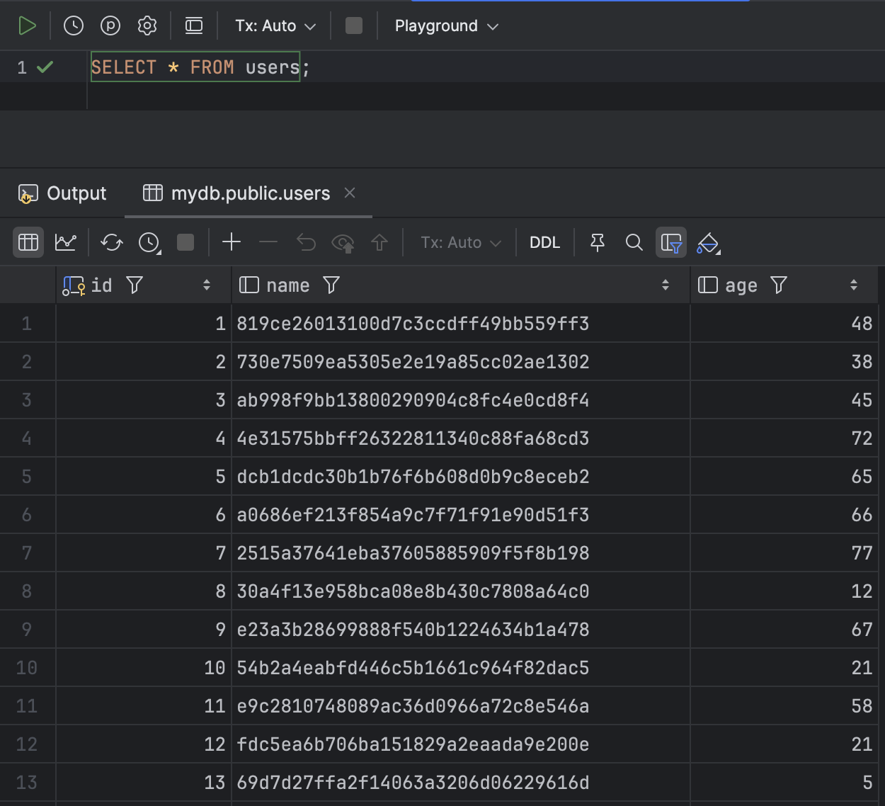

# Семинар 4. Docker и PostgreSQL

## Введение

Цель семинара — познакомиться с основами Docker и Docker Compose, а также научиться работать с PostgreSQL в контейнерах.
Вы изучите, как создавать Dockerfile, управлять контейнерами через Docker Compose, сохранять данные с помощью volume и
управлять сетями. После каждого шага делайте скриншоты и описывайте результаты.

1. Напишите `docker-compose.yml` для PostgreSQL.
2. Заполните базу тестовыми данными.
3. Подключитесь через DataGrip.
4. Выполните тестовые SQL-запросы.
5. Перезапустите контейнер и проверьте сохранность данных.

## Напишите `docker-compose.yml` для PostgreSQL

Требуется разработать docker-compose файл для запуска двух PostgreSQL контейнеров. Один использует образ с версией 17,
второй с версией 16. Каждый контейнер должен быть доступен на своем порту. Для контейнеров используйте volume для
сохранения данных.

**Файл для выполнения:** `src/docker-compose.yml`

## Заполните базу тестовыми данными

1. Создайте таблицу `users` с полями `id`, `name`, `age`.
2. Заполните таблицу 10 000 случайными данными.

**Результат:**

Вставьте созданный SQL скрипт сюда:

```sql
CREATE TABLE users (
    id SERIAL PRIMARY KEY,
    name VARCHAR(100),
    age INT
);
```

```sql
INSERT INTO users (name, age)
SELECT md5(random()::text), floor(random() * 100)
FROM generate_series(1, 10000);
```

## Подключитесь через DataGrip

Подключитесь к базе данных PostgreSQL через DataGrip. Используйте данные из `docker-compose.yml`.

**Результат:**







## Выполните тестовые SQL-запросы

1. Выведите пользователей старше 50 лет.
2. Выведите пользователей, у которых имя начинается на `A`.

Тестовые запросы можно выполнить в любой из баз

**Результат:**

Вставьте скриншоты результатов запросов сюда:




## Перезапустите контейнер и проверьте сохранность данных

Перезапустите контейнер с базой данных и проверьте, что данные остались на месте.

**Результат:**

Вставьте скриншоты результатов запросов сюда:




