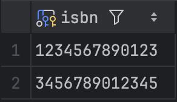
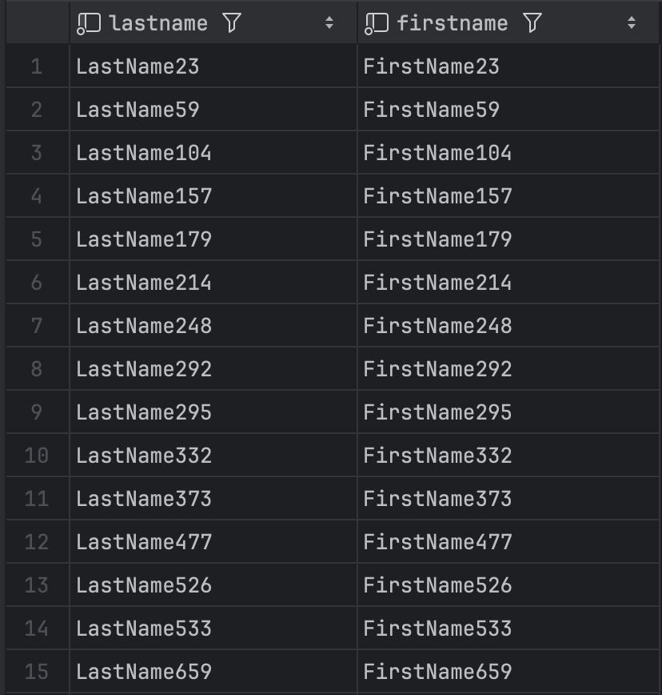
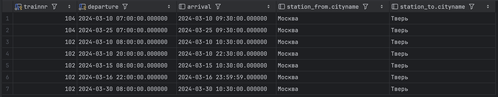

# Ответы на задания семинара 5

## Часть 1: Библиотечная система

### Вопрос 1.

Найдите фамилии читателей, проживающих в Москве.

```sql
SELECT lastname
FROM reader
WHERE address LIKE '%Москва%';
```


### Вопрос 2

Найдите книги (author, title), которые брал Иван Иванов.

```sql
SELECT b.author, b.title
FROM book b
JOIN borrowing br ON b.isbn = br.isbn
JOIN reader r ON br.id = r.id
WHERE r.lastname = 'Иванов' AND r.firstname = 'Иван';
```

<!--  -->
Нет таких строк.

### Вопрос 3

Найдите книги (ISBN) из категории "Горы", которые не относятся к категории "Путешествия" (игнорируя подкатегории).

```sql
SELECT bc.isbn
FROM bookcategory bc
WHERE bc.categoryname = 'Горы'
AND bc.isbn NOT IN (
    SELECT bc.isbn
    FROM bookcategory bc
    WHERE bc.categoryname = 'Путешествия'
);
```



### Вопрос 4

Найдите читателей (LastName, FirstName), которые вернули копию книги.

```sql
SELECT r.lastname, r.firstname
FROM reader r
JOIN borrowing br ON r.id = br.id
WHERE br.returndate IS NOT NULL;
```



### Вопрос 5

Найдите читателей (LastName, FirstName), которые брали хотя бы одну книгу, которую также брал Иван Иванов (не включая
самого Ивана Иванова).

```sql
SELECT DISTINCT r1.lastname, r1.firstname
FROM reader r1
JOIN borrowing br1 ON r1.id = br1.id
WHERE br1.isbn IN (
    SELECT br2.isbn
    FROM borrowing br2
    JOIN reader r2 ON br2.id = r2.id
    WHERE r2.lastname = 'Иванов' AND r2.firstname = 'Иван'
)
AND (r1.lastname != 'Иванов' OR r1.firstname != 'Иван');
```

<!--  -->
Нет таких строк.

## Часть 2: Поезда

### Вопрос 1

Найдите все прямые рейсы из Москвы в Тверь.

```sql
SELECT c.trainnr, c.departure, c.arrival, station_from.cityname, station_to.cityname
FROM connection c
JOIN station station_from ON c.fromstation = station_from.name
JOIN station station_to ON c.tostation = station_to.name
WHERE station_from.cityname = 'Москва'
AND station_to.cityname = 'Тверь';
```



### Вопрос 2

Найдите все многосегментные маршруты, имеющие точно однодневный трансфер из Москвы в Санкт-Петербург (первое отправление и прибытие в конечную точку должны быть в одну и ту же дату). Используйте функцию `DAY()` для атрибутов `Departure` и
`Arrival`.

```sql
SELECT DISTINCT c.trainnr
FROM connection c
JOIN station station_from ON c.fromstation = station_from.name
JOIN station station_to ON c.tostation = station_to.name
WHERE station_from.cityname = 'Москва'
AND station_to.cityname = 'Санкт-Петербург'
AND EXTRACT(DAY FROM c.departure) = EXTRACT(DAY FROM c.arrival)
AND c.trainnr IN (
    SELECT trainnr
    from connection
    GROUP BY trainnr
    HAVING count(*) > 1
);
```


