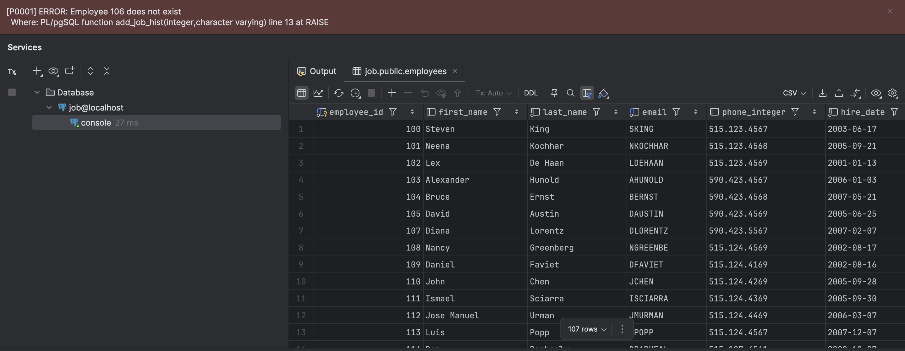
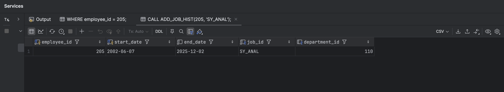
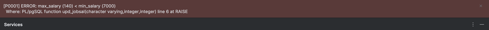
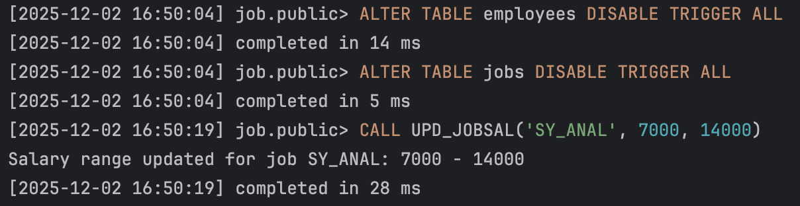
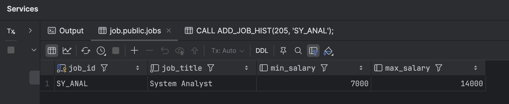
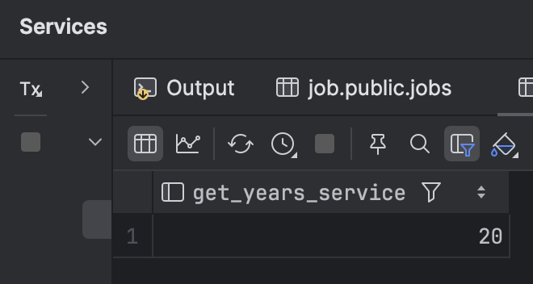
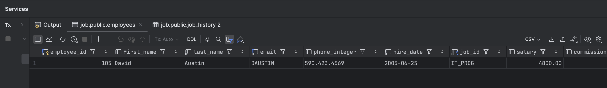
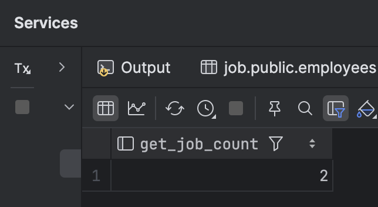
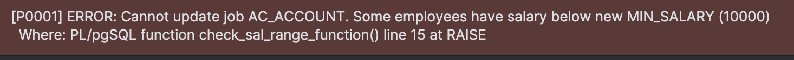
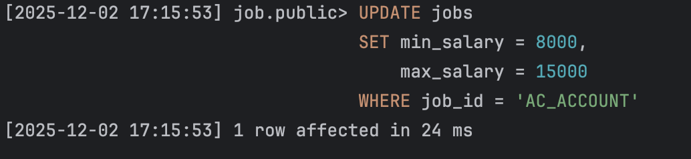

# Решение задач по хранимым процедурам и функциям

## Задания

### Задание 1. Создание хранимой процедуры.

**Цель:** процедура добавляет новую должность в таблицу `JOBS`. Максимальная зарплата для новой должности устанавливается как удвоенная минимальная зарплата.

a. Создайте хранимую процедуру с именем `NEW_JOB`, которая принимает три параметра:
- Идентификатор должности (`job_id`),
- Название должности (`job_title`),
- Минимальную зарплату (`min_salary`).

Ответ:
```sql
CREATE OR REPLACE PROCEDURE NEW_JOB(
    new_job_id      VARCHAR,
    new_job_title   VARCHAR,
    new_min_salary  INTEGER
)
LANGUAGE plpgsql
AS $$
BEGIN
    INSERT INTO jobs(job_id, job_title, min_salary, max_salary)
    VALUES (new_job_id, new_job_title, new_min_salary, new_min_salary * 2);
END;
$$;
```

b. Выполните процедуру, добавив должность со следующими параметрами:
- `job_id`: `'SY_ANAL'`
- `job_title`: `'System Analyst'`
- `min_salary`: `6000`

Ответ:
```sql
CALL NEW_JOB('SY_ANAL', 'System Analyst', 6000);
```

---

### Задание 2. Создание хранимой процедуры.

**Цель:** Добавить запись в историю изменения должности сотрудника и обновить данные сотрудника.

a. Создайте процедуру с именем `ADD_JOB_HIST`, которая принимает два параметра:
- Идентификатор сотрудника (`employee_id`),
- Новый идентификатор должности (`job_id`).

Процедура должна:
- Добавить новую запись в `JOB_HISTORY` с текущей датой найма сотрудника в качестве даты начала и сегодняшней датой в качестве даты окончания.
- Обновить дату найма сотрудника в таблице `EMPLOYEES` на сегодняшнюю дату.
- Изменить должность сотрудника на новую и установить его зарплату как минимальная зарплата этой должности плюс 500.
- Добавить обработку исключений на случай, если сотрудник не существует.

Ответ:
```sql
CREATE OR REPLACE PROCEDURE ADD_JOB_HIST(
    new_employee_id INTEGER,
    new_job_id      VARCHAR
)
LANGUAGE plpgsql
AS $$
DECLARE
    old_hire_date       DATE;
    old_department_id   INTEGER;
    old_min_salary      INTEGER;
BEGIN
    SELECT hire_date, department_id
    INTO old_hire_date, old_department_id
    FROM employees
    WHERE employee_id = new_employee_id;

    IF old_hire_date IS NULL THEN
        RAISE EXCEPTION 'Employee % does not exist', new_employee_id;
    END IF;

    SELECT min_salary
    INTO old_min_salary
    FROM jobs
    WHERE job_id = new_job_id;

    IF old_min_salary IS NULL THEN
        RAISE EXCEPTION 'Job % does not exist', new_job_id;
    END IF;

    INSERT INTO job_history(employee_id, start_date, end_date, job_id, department_id)
    VALUES (new_employee_id, old_hire_date, NOW(), new_job_id, old_department_id);

    UPDATE employees
    SET hire_date = NOW(),
        job_id = new_job_id,
        salary = old_min_salary + 500
    WHERE employee_id = new_employee_id;

EXCEPTION
    WHEN NO_DATA_FOUND THEN
        RAISE NOTICE 'Сотрудник с таким ID % не найден', new_employee_id;
END;
$$;
```

b. Отключите триггеры на таблицах `EMPLOYEES`, `JOBS`, `JOB_HISTORY`.

Ответ:
```sql
ALTER TABLE employees DISABLE TRIGGER ALL;
ALTER TABLE jobs DISABLE TRIGGER ALL;
ALTER TABLE job_history DISABLE TRIGGER ALL;
```

c. Выполните процедуру с параметрами:
- `employee_id`: `106`
- `job_id`: `'SY_ANAL'`

Ответ:
```sql
CALL ADD_JOB_HIST(106, 'SY_ANAL');
```

Вставьте скриншот результата выполнения.


d. Выполните запросы для проверки изменений в таблицах `JOB_HISTORY` и `EMPLOYEES`.

Ответ:
```sql
CALL ADD_JOB_HIST(205, 'SY_ANAL');

SELECT *
FROM job_history
WHERE employee_id = 205;

SELECT *
FROM employees
WHERE employee_id = 205;
```

Вставьте скриншоты результатов.



e. Зафиксируйте изменения (commit).

f. Включите триггеры обратно.

Ответ:
```sql
ALTER TABLE employees ENABLE TRIGGER ALL;
ALTER TABLE jobs ENABLE TRIGGER ALL;
ALTER TABLE job_history ENABLE TRIGGER ALL;
```

---

### Задание 3. Создание хранимой процедуры.

**Цель:** Обновить диапазон зарплат для указанной должности с обработкой исключений.

a. Создайте процедуру `UPD_JOBSAL`, принимающую три параметра:
- Идентификатор должности (`job_id`),
- Новую минимальную зарплату (`min_salary`),
- Новую максимальную зарплату (`max_salary`).

Добавьте обработку исключений:
- Если указан несуществующий идентификатор должности;
- Если максимальная зарплата меньше минимальной;
- Если строка заблокирована (используйте FOR UPDATE NOWAIT).

Ответ:
```sql
CREATE OR REPLACE PROCEDURE UPD_JOBSAL(
    p_job_id VARCHAR,
    p_min_salary INTEGER,
    p_max_salary INTEGER
)
LANGUAGE plpgsql
AS $$
DECLARE
    v_exists BOOLEAN;
BEGIN
    IF p_max_salary < p_min_salary THEN
        RAISE EXCEPTION 'max_salary (%) < min_salary (%)', p_max_salary, p_min_salary;
    END IF;

    SELECT TRUE
    INTO v_exists
    FROM jobs
    WHERE job_id = p_job_id
    FOR UPDATE NOWAIT;

    IF NOT v_exists THEN
        RAISE EXCEPTION 'Job % does not exist', p_job_id;
    END IF;

    UPDATE jobs
    SET min_salary = p_min_salary,
        max_salary = p_max_salary
    WHERE job_id = p_job_id;

    RAISE NOTICE 'Salary range updated for job %: % - %',
        p_job_id, p_min_salary, p_max_salary;

EXCEPTION
    WHEN lock_not_available THEN
        RAISE EXCEPTION 'Record for job % is locked by another transaction', p_job_id;

    WHEN NO_DATA_FOUND THEN
        RAISE EXCEPTION 'Job % does not exist', p_job_id;
END;
$$;
```

b. Выполните процедуру с параметрами: `job_id`='SY_ANAL', `min_salary`=7000, `max_salary`=140 (ожидается ошибка).

```sql
CALL UPD_JOBSAL('SY_ANAL', 7000, 140);
```
Вставьте скриншот ошибки.


c. Отключите триггеры на таблицах `EMPLOYEES`, `JOBS`.

Ответ:
```sql
ALTER TABLE employees DISABLE TRIGGER ALL;
ALTER TABLE jobs DISABLE TRIGGER ALL;
```

d. Повторно выполните процедуру с корректными параметрами: `min_salary`=7000, `max_salary`=14000.

Ответ:
```sql
CALL UPD_JOBSAL('SY_ANAL', 7000, 14000);
```

Вставьте скриншот результата выполнения.


e. Проверьте изменения в таблице `JOBS`.

```sql
SELECT *
FROM jobs
WHERE job_id = 'SY_ANAL';
```

Вставьте скриншот изменений.


f. Зафиксируйте изменения и включите триггеры обратно.

Ответ:
```sql
ALTER TABLE employees ENABLE TRIGGER ALL;
ALTER TABLE jobs ENABLE TRIGGER ALL;
```

---

### Задание 4. Создание хранимой функции.

**Цель:** Рассчитать стаж сотрудника.

a. Создайте функцию `GET_YEARS_SERVICE`, принимающую идентификатор сотрудника и возвращающую его стаж работы (в годах). Добавьте обработку исключений на случай несуществующего сотрудника.

Ответ:
```sql
CREATE OR REPLACE FUNCTION GET_YEARS_SERVICE(
    p_employee_id INTEGER
)
RETURNS INTEGER
LANGUAGE plpgsql
AS $$
DECLARE
    v_hire_date DATE;
    v_years     INTEGER;
BEGIN
    SELECT hire_date
    INTO STRICT v_hire_date
    FROM employees
    WHERE employee_id = p_employee_id;

    v_years := DATE_PART('year', AGE(NOW(), v_hire_date))::INT;

    RETURN v_years;

EXCEPTION
    WHEN NO_DATA_FOUND THEN
        RAISE EXCEPTION 'Employee % does not exist', p_employee_id;
END;
$$;
```

b. Вызовите функцию для сотрудника с ID 999, используя RAISE NOTICE (ожидается ошибка).

Ответ:
```sql
SELECT GET_YEARS_SERVICE(999);
```

Вставьте скриншот результата выполнения.


c. Вызовите функцию для сотрудника с ID 105.

Ответ:
```sql
SELECT GET_YEARS_SERVICE(105);
```

Вставьте скриншот результата выполнения.


d. Проверьте корректность данных запросом из таблиц `JOB_HISTORY` и `EMPLOYEES`.

Вставьте скриншот результата.


---

### Задание 5. Создание хранимой функции.

**Цель:** Получить количество уникальных должностей сотрудника.

a. Создайте функцию `GET_JOB_COUNT`, возвращающую количество уникальных должностей, на которых работал сотрудник (включая текущую). Используйте UNION и DISTINCT. Добавьте обработку исключений для несуществующего сотрудника.

Ответ:
```sql
CREATE OR REPLACE FUNCTION GET_JOB_COUNT(
    p_employee_id INTEGER
)
RETURNS INTEGER
LANGUAGE plpgsql
AS $$
DECLARE
    v_exists BOOLEAN;
    v_count  INTEGER;
BEGIN
    SELECT TRUE
    INTO v_exists
    FROM employees
    WHERE employee_id = p_employee_id;

    IF NOT v_exists THEN
        RAISE EXCEPTION 'Employee % does not exist', p_employee_id;
    END IF;

    SELECT COUNT(*)
    INTO v_count
    FROM (
        SELECT job_id
        FROM employees
        WHERE employee_id = p_employee_id

        UNION

        SELECT job_id
        FROM job_history
        WHERE employee_id = p_employee_id
    ) AS t;

    RETURN v_count;
END;
$$;
```

b. Вызовите функцию для сотрудника с ID 176.

Ответ:
```sql
SELECT GET_JOB_COUNT(176);
```

Вставьте скриншот результата выполнения.


---

### Задание 6. Создание триггера.

**Цель:** Проверить, что изменение зарплат должности не выводит текущие зарплаты сотрудников за новые пределы.

a. Создайте триггер `CHECK_SAL_RANGE`, срабатывающий перед обновлением столбцов `MIN_SALARY` и `MAX_SALARY` таблицы `JOBS`. Триггер должен проверять текущие зарплаты сотрудников и выдавать исключение, если новая зарплата выходит за пределы заданного диапазона.

Ответ:
```sql
CREATE OR REPLACE FUNCTION CHECK_SAL_RANGE_FUNCTION()
RETURNS trigger
LANGUAGE plpgsql
AS $$
DECLARE
    v_min_violation BOOLEAN;
    v_max_violation BOOLEAN;
BEGIN
    SELECT EXISTS (
        SELECT 1
        FROM employees
        WHERE job_id = NEW.job_id
          AND salary < NEW.min_salary
    )
    INTO v_min_violation;

    IF v_min_violation THEN
        RAISE EXCEPTION
            'Cannot update job %. Some employees have salary below new MIN_SALARY (%)',
            NEW.job_id, NEW.min_salary;
    END IF;

    SELECT EXISTS (
        SELECT 1
        FROM employees
        WHERE job_id = NEW.job_id
          AND salary > NEW.max_salary
    )
    INTO v_max_violation;

    IF v_max_violation THEN
        RAISE EXCEPTION
            'Cannot update job %. Some employees have salary above new MAX_SALARY (%)',
            NEW.job_id, NEW.max_salary;
    END IF;

    RETURN NEW;
END;
$$;

CREATE TRIGGER CHECK_SAL_RANGE
BEFORE UPDATE OF min_salary, max_salary
ON jobs
FOR EACH ROW
EXECUTE FUNCTION CHECK_SAL_RANGE_FUNCTION();
```

b. Протестируйте триггер с диапазоном от 10000 до 20000 для должности AC_ACCOUNT (ожидается ошибка).

Ответ:
```sql
UPDATE jobs
SET min_salary = 10000,
    max_salary = 20000
WHERE job_id = 'AC_ACCOUNT';
```

Вставьте скриншот ошибки.


c. Затем установите диапазон от 8000 до 15000 и объясните результат.

Вставьте скриншот результата и напишите объяснение.


Объяснение:
```markdown
В первом случае возникает ошибка, потому что есть сотрудники, у которых `salary < 1000`, а во втором случае все сотрудники удовлетворяют диапазону зарплаты от 8000 до 15000.
То есть, так как есть хотя бы одна строка, неудовлетворяющая условию, то обновление не происходит.
```

---

